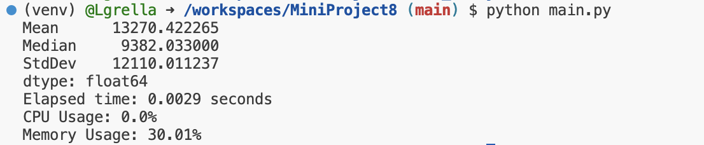
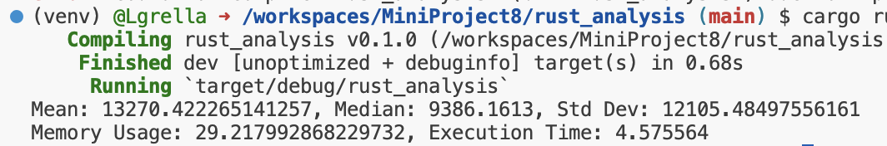

# Mini Project 8 - Data Engineering Systems

The purpose of this exercise is to transform python code into rust code and investigate the storage and runtime differences between the two languages. 

I chose to perform relatively simple descriptive statistics: mean, median, and standard deviation on the insurances.csv file found on Kaggle [here](https://www.kaggle.com/datasets/mirichoi0218/insurance).This data source looks at the personal medical costs for individual people, providing additional attributes for each person (like age, smoker status, gender).

# Process:
**1. Set-Up Python Environment:**
*  The dockerfile and the dev container provided in this repository set up a standard python environment. This is needed so we are able to run our python code.
*  Opening codespaces will automatically set up the python environment, but also will install all of the dependencies.
**2. Set-Up Rust within this Environment:**
*  First, we must run the following in the terminal. This installs rust.
```
curl --proto '=https' --tlsv1.2 -sSf https://sh.rustup.rs/ | sh
```
* Next, we must configure the current shell by running the following also in the terminal.
```
source "$HOME/.cargo/env"
```
*  To create a rust space to work in, again run the following in the terminal to create a folder for rust programs. Cargo is rust's build tool. This will create a Cargo.toml file that will need to be updated with any dependencies needed for the analysis programs to run. This step also creates a src folder containing a main.rs script. This will be the starting point for any new programs.
```
cargo new rust_analysis
```
# Running the Programs:
**1. Running Rust Programs**
*  In the terminal navigate to the main rust folder (in this case rust_analysis). To determine where you should navigate, make sure the final destination is where the Cargo.toml file is located.
*  To run your program, execute cargo run in the terminal.

**2. Running Python Programs**
*  Moving back to the main directory, run "python main.py" in the terminal to execute the main.py program.'

# Analysis

As stated above, the program I created (in both Python and Rust) solely has the purpose of grabbing the descriptive statistics from the "charges" column of the insurance.csv file. As someone who is new to Rust, I used github copilot chat and github copilot labs to transform my python code into rust code. 

After running both, I got the below descriptive statistics and usage information. These programs are narrow in scope so I do not end up seeing much difference in any of the usage/execution information.
Knowing the perks of rust as an extremely efficient language, I expect as programs get larger and more complex that rust execution time will be significantly less than that of python.

**Python Execution:**


**Rust Execution:**



